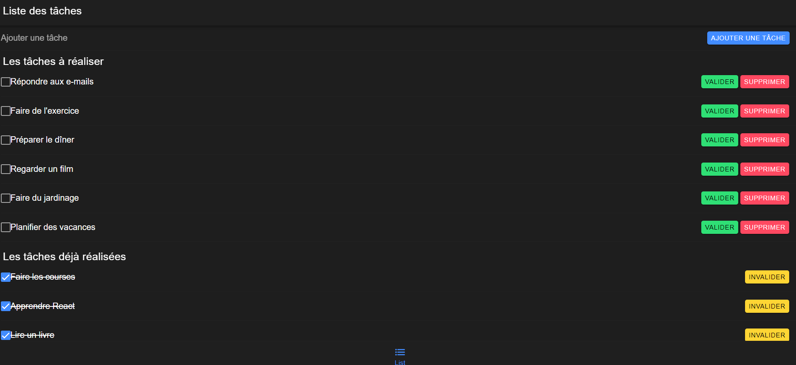

---

# Application de Liste de Tâches avec Ionic et React

## 🚀 Aperçu
Cette application de liste de tâches simple est construite avec Ionic et React. Elle permet aux utilisateurs de gérer leurs tâches en les ajoutant, les complétant, les invalidant et les supprimant. L'application utilise RxJS pour gérer les opérations asynchrones et récupérer des données à partir d'une API.

## 🌟 Fonctionnalités
- Ajouter une nouvelle tâche à la liste.
- Marquer une tâche comme complétée ou invalidée.
- Supprimer une tâche.
- Afficher une liste de tâches actives et complétées.
- Double-cliquer sur une tâche pour basculer son état de complétude ou son état de validation.

## 🛠️ Installation
1. **Clonez le dépôt sur votre machine locale :**
    ```bash
    git clone https://github.com/NordyFly/Ionic_Task.git
    ```

2. **Accédez au répertoire du projet :**
    ```bash
    cd [repertoire_du_projet]
    ```

3. **Installez les dépendances :**
    ```bash
    npm install
    ```

## 🚀 Utilisation
1. **Démarrez le serveur de développement Ionic :**
    ```bash
    ionic serve
    ```

2. **Ouvrez votre navigateur et accédez à [http://localhost:8100](http://localhost:8100) pour voir l'application.**

## ⚙️ Configuration de l'API
L'application suppose la présence d'un serveur JSON s'exécutant localement à `http://localhost:3001/tasks`. Vous pouvez configurer un serveur JSON ou mettre à jour l'URL de l'API dans le code pour pointer vers votre backend souhaité.

### 🛠️ Configuration du Serveur JSON
1. **Installez JSON Server globalement :**
    ```bash
    npm install -g json-server
    ```

2. **Créez un fichier `db.json` avec le contenu suivant :**
    ```json
    {
      "tasks": []
    }
    ```

3. **Démarrez le serveur JSON :**
    ```bash
    json-server --watch db.json --port 3001
    ```

## 📝 Notes de Développement
- L'application utilise les composants Ionic pour l'interface utilisateur, y compris les boutons, les cases à cocher et les listes.
- RxJS est utilisé pour gérer les opérations asynchrones et gérer le cycle de vie du composant.
- L'application suppose une API RESTful pour la gestion des tâches.

## 📄 Licence
Ce projet est sous licence [MIT](LICENSE). N'hésitez pas à le modifier et à l'utiliser pour vos propres projets.

## 💖 Remerciements
- Ce projet a été créé avec les frameworks Ionic et React.
- RxJS est utilisé pour gérer les opérations asynchrones.
- Merci à la communauté pour ses contributions et son soutien.

N'hésitez pas à contribuer au projet ou à fournir des commentaires !

---
